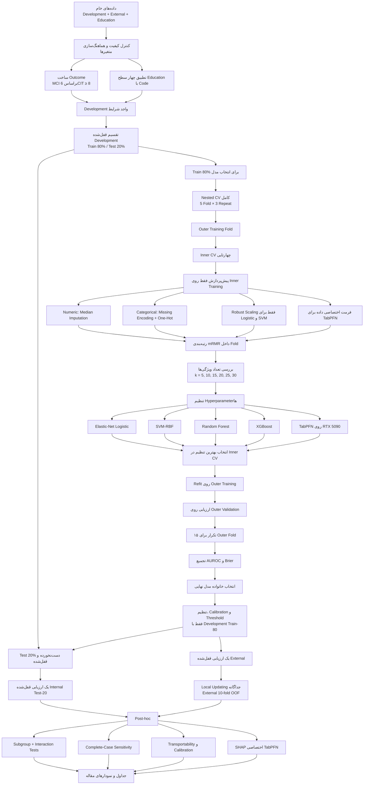

# تحویل کامل پروژه MCIExternal برای ادامه در چت جدید

تاریخ تکمیل اجرای محلی: 2026-08-02
زبان سند: فارسی
وضعیت نهایی تحلیل: **آماده برای نگارش مقاله (`ready_for_manuscript_writing`)**

> این سند خلاصه عملیاتی جامع گفتگو، تصمیم‌ها، اجرای پایپ‌لاین، خطاهای اصلاح‌شده، نتایج نهایی و مسیر فایل‌هاست. آن را در چت جدید ضمیمه کنید تا ادامه کار از مرحله نگارش مقاله انجام شود و تحلیل‌ها بی‌دلیل تکرار نشوند.

## 1. درخواست و تصمیم نهایی کاربر

- پروژه باید روی همین کامپیوتر و به‌صورت Local اجرا شود؛ نه روی Kaggle.
- مسیر پروژه: `D:\Nazila\MCIExternal`
- GitHub برای دریافت کد و Kaggle فقط برای دریافت داده‌ها استفاده شد.
- یک محیط اختصاصی برای پروژه ساخته شد.
- ابتدا تمام محیط‌های موجود بررسی شدند تا وابستگی‌های سنگین دوباره دانلود نشوند.
- انتخاب مدل فقط با Development train-80 انجام شد.
- Internal test-20 و External تا پایان انتخاب مدل قفل ماندند.
- سطح تحصیلات External از فایل کمکی و با تطبیق `Code` به چهار سطح هماهنگ شد.
- MICE بنا بر درخواست پژوهشگر انجام نشد.
- خروجی participant-level نوشته نشد؛ خروجی‌های مقاله aggregate-only هستند.

## 2. مخزن، شاخه و وضعیت Git

- Repository: `moftianacademic403-coder/MCIExternal-ML`
- Branch: `codex/final-four-level-manuscript-pipeline`
- مسیر Clone محلی: `D:\Nazila\MCIExternal`
- اصلاحات نهایی، اسکریپت اجرای قابل‌حمل، راهنمای بازتولید و سازنده شکل‌های حرفه‌ای
  مقاله در همین شاخه نسخه‌بندی شده‌اند. داده‌های خام و خروجی‌های participant-level
  عمداً در Git قرار نگرفته‌اند.
- `git diff --check` خطای whitespace نداشت؛ فقط هشدار احتمالی تبدیل LF به CRLF در ویندوز دیده شد.
- راهنمای اجرای مجدد در `docs/LOCAL_REPRODUCTION.md` و فرمان کامل در
  `run_local_full_pipeline.ps1` قرار دارد.

## 3. داده‌ها و کنترل صحت

### فایل‌های ورودی

| فایل | ابعاد/نقش | SHA-256 |
|---|---|---|
| `Developement.csv` | Development؛ 2001 × 61 | `CFFC5E26BD754B3AE431D1A4EDFFD2D30D8BEF086C8E44F989B87D209D4F4588` |
| `External.xlsx` | External؛ 1345 × 63 | `786E19FFCDFCAF660EA69F073411BBC2B02D6FB9F6C8840EB6960C4F23237BED` |
| `phas3_DR.Moftian.xlsx` | منبع کمکی Education؛ 1345 × 68 | `85DB06E597CE4533FC87290BB3D113AE91CF7F0383CE17C0C2560C07768DA02D` |

### Outcome و تقسیم داده

- Outcome: `MCI = 6CIT >= 8`
- Development واجد شرایط: 2000 ردیف
- ردیف حذف‌شده به‌علت MCI نامعتبر/گمشده: 1
- Development train-80: 1600 ردیف؛ 756 MCI و 844 non-MCI
- Internal test-20 قفل‌شده: 400 ردیف؛ 189 MCI و 211 non-MCI
- External قفل‌شده: 1345 ردیف
- تعداد predictorهای کاندید پیش از ranking: 43
- correlation pruning اعمال نشد.

### هماهنگ‌سازی Education

- تطبیق بر اساس `Code`: 1345 از 1345 ردیف External
- Code گمشده از منبع: صفر
- Code اضافی در منبع: صفر
- Education گمشده: 17
- توزیع چهارسطحی:
  - primary: 499
  - secondary/high school: 351
  - illiterate: 343
  - academic/university: 135
  - missing: 17
- حالت ثبت‌شده در همه manifestها: `four_level_code_matched_auxiliary_source`

## 4. محیط اختصاصی و سخت‌افزار

- محیط اختصاصی: `D:\Nazila\MCIExternal\.conda-env`
- این محیط با clone کردن محیط موجود `D:\Nazila\NAFLD\env` ساخته شد تا دانلود و نصب مجدد وابستگی‌های سنگین انجام نشود.
- محیط مبدأ دست‌نخورده باقی ماند.
- Python: 3.11.15
- PyTorch: 2.11.0+cu128
- GPU: NVIDIA GeForce RTX 5090
- CUDA فعال و تست matrix multiplication و inference واقعی TabPFN موفق بود.
- TabPFN: 8.2.0
- scikit-learn: 1.6.1
- XGBoost: 3.2.0
- NumPy: 2.4.6
- pandas: 3.0.3
- `pip check`: بدون dependency شکسته
- برای interpretability نسخه pin‌شده زیر نصب شد:
  - `tabpfn-extensions[interpretability]==0.4.1`
  - شامل `shapiq==1.4.1` و وابستگی‌های لازم

### Checkpoint مدل

- مجوز یک‌باره Prior Labs برای `tabpfn_3` پذیرفته شد.
- downloader داخلی Xet روی ویندوز متوقف می‌شد؛ checkpoint رسمی مستقیماً از Hugging Face دریافت شد.
- مسیر cache:
  `C:\Users\MOFTIAN\AppData\Roaming\tabpfn\tabpfn-v3-classifier-v3_default.ckpt`
- اندازه: 212,804,803 بایت
- SHA-256 تأییدشده:
  `D0D865D54DFBC524F5703104BE90620182DCA7E5FB2C16DE72E9959EA18F3988`
- inference واقعی روی CUDA با پیام `TABPFN_MODEL_READY (2, 2)` موفق شد.

## 5. پیش‌پردازش و جلوگیری از Data Leakage

- split اولیه یک‌بار، stratified و با seed ثابت `20260728` ساخته شد.
- تمام preprocessingها داخل fold انجام شدند.
- برای مدل‌های کلاسیک:
  - Numeric median imputation با missing indicator
  - Categorical constant-missing imputation
  - One-hot encoding برای categoricalها
  - Robust scaling فقط برای Logistic و SVM
- برای TabPFN:
  - missing/categorical handling بومی TabPFN
  - بدون one-hot encoding و بدون scaling
- mRMR:
  - در هر inner-training fold دوباره محاسبه شد.
  - روی full outer-training fold نیز پیش از outer validation دوباره محاسبه شد.
- External و Internal test-20 در model selection استفاده نشدند.
- External outcome فقط پس از قفل‌شدن مدل برای validation و تحلیل‌های ثانویه استفاده شد.

## 6. فلوچارت کامل پایپ‌لاین



## 7. تنظیم و اجرای Nested CV

- Outer folds: 5
- Outer repeats: 3
- مجموع outer evaluations: 15 برای هر مدل
- Inner folds: 4
- مدل‌های کلاسیک: 40 candidate در هر outer fold
- TabPFN: سه candidate در هر outer fold
- مدل‌های مقایسه‌شده:
  - Elastic-Net Logistic Regression
  - SVM-RBF
  - Random Forest
  - XGBoost
  - TabPFN-3
- معیار اولیه انتخاب: mean outer-fold AUROC
- معیار ثانویه: mean outer-fold Brier score
- Bootstrapهای گزارش نهایی: 2000

## 8. نتیجه انتخاب مدل

- مدل منتخب: **TabPFN**
- خانواده: `tabular_foundation_model`
- تنظیم منتخب:
  - `k = 20`
  - `n_estimators = 8`
- Calibration با Development train-80 OOF:
  - intercept = 0.008174
  - slope = 0.893391

### بیست ویژگی نهایی

1. `iadl`
2. `household_income`
3. `visual_acuity_both`
4. `sleep_quality`
5. `employment_status`
6. `whisper_test_left`
7. `osteoporosis_status`
8. `education`
9. `adl`
10. `age`
11. `current_smoker`
12. `depression_status`
13. `housing_status`
14. `waist_hip_ratio`
15. `hypertension`
16. `max_handgrip`
17. `history_heart_failure`
18. `history_stroke`
19. `rbc`
20. `ldl_cholesterol`

### عملکرد Nested CV

| مدل | Mean AUROC | 95% CI توصیفی | Mean AP | Mean Brier |
|---|---:|---:|---:|---:|
| TabPFN | 0.7990 | 0.7849–0.8120 | 0.7960 | 0.1826 |
| Random Forest | 0.7934 | 0.7800–0.8056 | 0.7904 | 0.1878 |
| SVM-RBF | 0.7932 | 0.7812–0.8054 | 0.7922 | 0.1847 |
| XGBoost | 0.7929 | 0.7808–0.8054 | 0.7924 | 0.1841 |
| Elastic-Net Logistic | 0.7929 | 0.7808–0.8044 | 0.7900 | 0.1857 |

> هشدار روش‌شناختی: فاصله‌های bootstrap روی outer folds توصیفی‌اند، چون foldهای repeated CV کاملاً مستقل نیستند.

## 9. ارزیابی قفل‌شده نهایی

### Internal test-20 قفل‌شده

- N = 400
- AUROC: **0.8028** (95% CI: 0.7590–0.8444)
- Average precision: 0.7959 (0.7492–0.8430)
- Brier score: 0.1801 (0.1620–0.1991)
- Calibration intercept: 0.0150 (−0.2185 تا 0.2486)
- Calibration slope: 1.0552 (0.8216–1.2888)
- در threshold اولیه target-sensitivity-85 برابر 0.329254:
  - Sensitivity: 0.8624
  - Specificity: 0.5261
  - PPV: 0.6198
  - NPV: 0.8102
  - Accuracy: 0.6850
  - Balanced accuracy: 0.6943

### External validation قفل‌شده

- N = 1345
- AUROC: **0.8314** (95% CI: 0.8096–0.8519)
- Average precision: 0.8449 (0.8221–0.8676)
- Brier score: 0.1855 (0.1764–0.1946)
- Calibration intercept: −0.8018 (−0.9598 تا −0.6439)
- Calibration slope: 1.2505 (1.1113–1.3897)
- در threshold اولیه target-sensitivity-85 برابر 0.329254:
  - Sensitivity: 0.9789
  - Specificity: 0.2019
  - PPV: 0.5790
  - NPV: 0.8951
  - Accuracy: 0.6126
  - Balanced accuracy: 0.5904

### Thresholdهای مشتق‌شده فقط از Development train-80 OOF

| Operating point | Threshold |
|---|---:|
| Youden | 0.498857 |
| Target sensitivity 80% | 0.375384 |
| Target sensitivity 85% | 0.329254 |
| Target sensitivity 90% | 0.274949 |

## 10. تحلیل سه‌لایه External

### Layer A — مدل قفل‌شده + threshold اولیه 85%

- Sensitivity: 0.9789
- Specificity: 0.2019
- PPV: 0.5790
- NPV: 0.8951
- Accuracy: 0.6126
- Balanced accuracy: 0.5904
- Brier: 0.1855

### Layer B — مدل قفل‌شده + threshold محلی 85% به‌صورت 10-fold

- Sensitivity: 0.8495
- Specificity: 0.6293
- PPV: 0.7199
- NPV: 0.7885
- Accuracy: 0.7457
- Balanced accuracy: 0.7394
- Brier: 0.1855

### Layer C — recalibration محلی OOF + threshold محلی 85%

- Sensitivity: 0.8495
- Specificity: 0.6293
- PPV: 0.7199
- NPV: 0.7885
- Accuracy: 0.7457
- Balanced accuracy: 0.7394
- Brier: **0.1675**

> مرز تفسیر: Layer A validation تأییدی قفل‌شده است. Layerهای B و C تحلیل‌های ثانویه local updating هستند و نباید به‌عنوان validation خارجی مستقل جدید معرفی شوند.

## 11. Post-hoc، حساسیت و Interpretability

- وضعیت: `posthoc_sensitivity_transportability_and_interpretability_completed`
- مدل اولیه تغییر نکرد: TabPFN همچنان مدل اصلی است.
- سناریوهای حساسیت اجراشده:
  - all 43 features
  - mRMR 30-repeat consensus top-30
  - Elastic-Net stability top-30
  - حذف ADL/IADL از frozen features
  - post-hoc transportable core
  - winsorized frozen features
  - complete-case frozen features
- mRMR stability repeats: 30
- Elastic-Net stability repeats: 30
- Bootstrap repeats: 2000
- MICE: انجام نشد، مطابق درخواست پژوهشگر
- Subgroup performance و interaction tests برای Internal و External انجام شد.
- Transportability/drift analysis انجام شد.
- SHAP:
  - مدل: TabPFN
  - روش: shapiq imputation explainer با تبدیل به `shap.Explanation`
  - دامنه: 50 ردیف stratified از locked internal test
  - budget per row: 256
  - وضعیت: completed
  - تفسیر: association، نه causal effect

## 12. گیت‌های نهایی

| مرحله | Manifest | Status مورد تأیید |
|---|---|---|
| Nested CV | `selection/nested_cv_manifest.json` | `development_only_nested_cv_model_family_selected` |
| Final evaluation | `final_evaluation/final_evaluation_manifest.json` | `manuscript_grade_locked_evaluation_completed` |
| Post-hoc | `analysis/posthoc_manifest.json` | `posthoc_sensitivity_transportability_and_interpretability_completed` |
| Manuscript package | `manuscript_readiness_manifest.json` | `ready_for_manuscript_writing` |

- `required_missing = []`
- `participant_level_outputs_written = false`
- `mice_performed = false`

## 13. خطاهای پیدا و اصلاح‌شده در این گفتگو

1. **TabPFN Windows browser auth**
   - `select.select([sys.stdin])` روی stdin redirectشده ویندوز `WinError 10038` می‌داد.
   - فقط در site-package محیط اختصاصی پروژه اصلاح شد تا منتظر callback مرورگر بماند.
   - این تغییر داخل Git نیست و با ساخت مجدد محیط از بین می‌رود؛ checkpoint و token cache اکنون موجودند.

2. **Xet/Hugging Face download stall**
   - downloader در 128 KB متوقف می‌شد.
   - checkpoint رسمی با curl مستقیم دریافت و SHA-256 تأیید شد.

3. **Runner false failure on empty ExitCode**
   - Nested CV کامل شده بود، ولی Runner مقدار ExitCode خالی را failure تلقی کرد.
   - Runner resume-aware شد و manifest را منبع حقیقت قرار داد.

4. **Runner treating warnings as fatal**
   - `ConvergenceWarning` به‌علت ترکیب stderr با PowerShell pipeline توقف ایجاد می‌کرد.
   - stdout/stderr هر stage جدا و فقط ExitCode واقعی معیار failure شد.

5. **Post-hoc calibration call mismatch**
   - `_reliability_bins` اکنون چهار آرگومان می‌خواست، اما call-site قدیمی سه آرگومان می‌داد.
   - `model_name` و `analysis` صحیح افزوده شدند.

6. **tabpfn_extensions / shapiq API mismatch**
   - پکیج اختیاری ابتدا موجود نبود؛ نسخه pin‌شده نصب شد.
   - تابع `shapiq_to_shap_explanation` در wheel 0.4.1 export نشده بود.
   - تبدیل first-order InteractionValues به `shap.Explanation` به‌صورت مستقیم و قابل بازتولید پیاده‌سازی شد.
   - تست واقعی GPU با `SHAPIQ_SMOKE_OK (1, 2)` موفق شد.

7. **Participant-flow stale partition names**
   - کد نام‌های قدیمی `development_train_80` و `development_internal_test_20` را استفاده می‌کرد.
   - با `train_80` و `internal_test_20_locked` هماهنگ شد.

8. **Workbook artifact-tool CSV append issue**
   - `workbook.fromCSV` روی workbook غیرخالی خطای `hydrateCrdtFromProto` می‌داد.
   - هر CSV ابتدا در workbook موقت import و سپس typed values به sheet اصلی منتقل شد.

## 14. مسیر خروجی‌ها

### خروجی Heavy

`D:\Nazila\MCIExternal\outputs\workstation_heavy_four_level_final`

- `selection/`
- `final_evaluation/`
- `local_pipeline_status.json`
- logهای stdout/stderr مراحل

### خروجی Post-hoc

`D:\Nazila\MCIExternal\outputs\workstation_posthoc_four_level_final\analysis`

### بسته مقاله

`D:\Nazila\MCIExternal\outputs\manuscript_four_level_final`

- `manuscript_readiness_manifest.json`
- `tables/` شامل 19 جدول اصلی و supplementary
- `figures/` شامل PNG و TIFF برای 11 شکل/شکل تکمیلی
- `MCI_Manuscript_Tables.xlsx`
- `qc_workbook_previews/` شامل render هر 20 sheet

### Workbook نهایی

نسخه اصلی پروژه:

`D:\Nazila\MCIExternal\outputs\manuscript_four_level_final\MCI_Manuscript_Tables.xlsx`

نسخه تحویلی Codex:

`C:\Users\MOFTIAN\Documents\Codex\2026-08-01\hdk\outputs\MCI_Manuscript_Tables.xlsx`

- Workbook دارای 20 sheet است.
- تمام 20 sheet render و بصری بررسی شدند.
- formula error scan نتیجه صفر داشت.
- README، جدول Performance و جدول‌های بزرگ Sensitivity/Subgroups به‌صورت اختصاصی بررسی شدند.

## 15. آیا پروژه برای مقاله آماده است؟

**بله، بخش تحلیل محاسباتی پروژه کامل و manuscript-ready است.**

موارد تکمیل‌شده:

- QC و harmonization
- Nested preprocessing و feature selection بدون leakage
- انتخاب مدل Development-only
- locked internal evaluation
- locked External validation
- calibration، threshold analysis و DCA
- local updating به‌صورت جدا و secondary
- subgroup و interaction tests
- complete-case و سایر sensitivity analyses
- transportability/drift
- SHAP برای مدل منتخب
- جداول و شکل‌های aggregate-only
- workbook نهایی و visual QA

مواردی که هنوز «تحلیل» نیستند و باید در مرحله نگارش انجام شوند:

1. انتخاب مجله هدف و تطبیق word limit/ساختار.
2. نهایی‌کردن عنوان، abstract و key messages.
3. نگارش Methods دقیقاً مطابق همین design.
4. نگارش Results فقط از جدول‌های manuscript package.
5. Discussion با تأکید بر:
   - discrimination خوب External
   - miscalibration در External قفل‌شده
   - افت specificity در threshold اولیه 85%
   - نقش ثانویه local recalibration/thresholding
   - عدم causal interpretation برای SHAP
   - عدم استقلال کامل repeated-CV folds
6. تکمیل reporting checklist مناسب، احتمالاً TRIPOD+AI / PROBAST+AI طبق نیاز مجله.
7. بررسی نهایی نام نویسندگان، affiliationها، ethics، funding، conflicts و data/code availability توسط پژوهشگر.

## 16. مرزهای تفسیری مهم برای مقاله

- External validation قفل‌شده، نتیجه تأییدی اصلی است.
- local recalibration، local threshold و transportable core ثانویه‌اند.
- External outcome برای انتخاب اولیه مدل استفاده نشده است.
- SHAP تفسیر associational دارد و causal نیست.
- MICE انجام نشده و باید صریحاً در Methods ذکر شود.
- مدل TabPFN کمی بالاتر از رقبا بود؛ اختلاف‌ها کوچک‌اند و نباید superiority اغراق‌آمیز ادعا شود.
- Calibration External ضعیف‌تر از Internal است؛ intercept منفی و slope بالاتر از یک باید بحث شوند.
- sensitivity بسیار بالا در threshold اولیه External با specificity پایین همراه است؛ trade-off بالینی باید شفاف گزارش شود.
- اجرای local updating نباید validation مستقل جدید نامیده شود.

## 17. پیشنهاد prompt برای شروع چت جدید

```text
فایل PROJECT_COMPLETE_HANDOFF_FA.md را کامل بخوان. پروژه تحلیلی تمام شده و manifest نهایی ready_for_manuscript_writing است. هیچ تحلیل اصلی را دوباره اجرا نکن مگر اینکه تناقض مشخصی پیدا کنی. ابتدا خروجی‌های manuscript package و جداول/شکل‌ها را بررسی کن، سپس برای نگارش مقاله یک plan بده. مقاله باید بین locked External validation و secondary local updating مرزبندی صریح داشته باشد، از ادعای causal برای SHAP پرهیز کند، و اعداد Results را فقط از فایل‌های نهایی پروژه بگیرد. نسخه GitHub شامل کد نهایی، راهنمای بازتولید محلی و سازنده شکل‌های مقاله است؛ داده‌های خصوصی باید جداگانه در اختیار محیط اجرا قرار گیرند.
```

## 18. جمع‌بندی یک‌خطی

پایپ‌لاین کامل MCI screening به‌صورت Local روی RTX 5090 اجرا شد؛ TabPFN با 20 ویژگی در Development-only nested CV انتخاب شد، Internal و External قفل‌شده ارزیابی شدند، Post-hoc/SHAP و همه جداول و شکل‌ها تکمیل شدند و پروژه اکنون برای نگارش مقاله آماده است.
